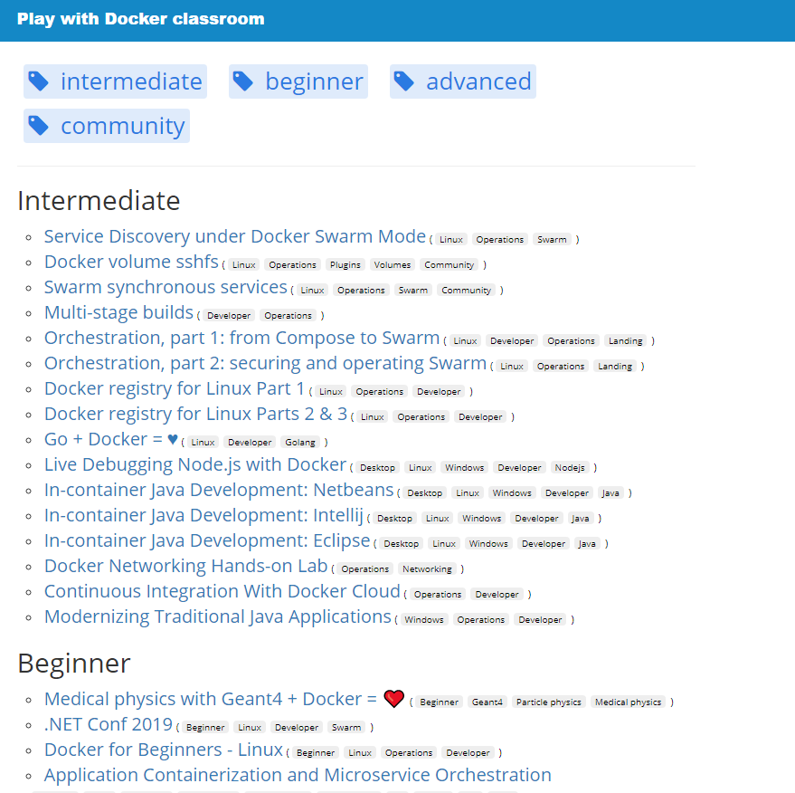

# Docker Hands-On Labs

The Play with Docker classroom brings you labs and tutorials that help you get hands-on experience using Docker. In this classroom you will find a mix of labs and tutorials that will help Docker users, including SysAdmins, IT Pros, and Developers. There is a mix of hands-on tutorials right in the browser, instructions on setting up and using Docker in your own environment, and resources about best practices for developing and deploying your own applications.

##  Play With Docker

Access the labs available from this link  [Play with Docker Classroom](https://training.play-with-docker.com/alacart/) 

> Note you may need to open in a private or incognito session, or disable all extensions to use the Play with Docker interface. It is also possible that some corporate proxies and firewalls will make Play with Docker difficult to use.
